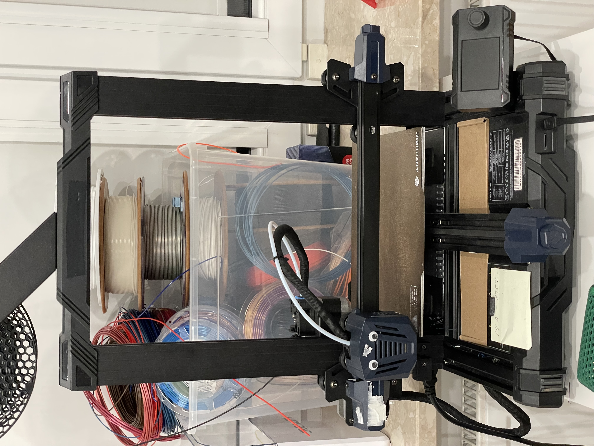

# Home
## Intro
Welcome to My Mod Page!

I decided to make a website to showcase my Kobra Go and the mods I’ve performed to it.

I'll be keeping this up to date to the best of my ability!

## Current Status


* Software: 
    ```Stock Marlin (Trying to get klipper working)```
* Mainboard:
    ```TriGorilla V_3.0.6 (Stock) + Rpi 4 4GB```
* Drivers:
    ```Stock```
* Stepper Motors:
    ```Stock```
* Hotend:
    ```Stock (maybe update later?)```
* Extruder:
    ```Stock (Bowden)```
* Printhead:
    ```Stock + eyes ofc (maybe update later?)```
